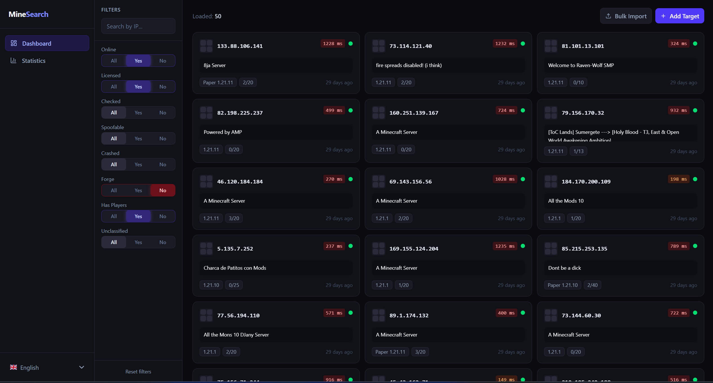
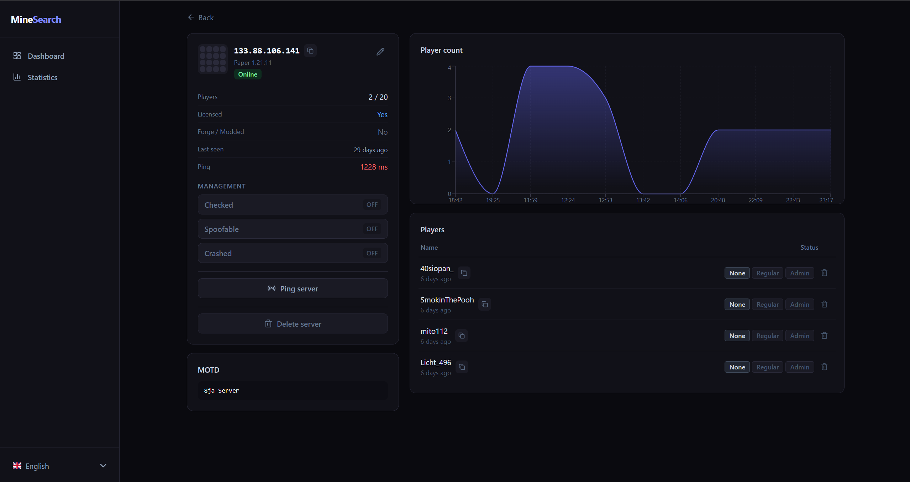

#  MineSearch

[](https://www.gnu.org/licenses/gpl-3.0)

**MineSearch** is a powerful search engine for Minecraft servers. It scans and indexes active servers and nicknames so you can easily find a server and analyze its data.

> [!CAUTION]
> RUNNING THE WORKER MAY RESULT IN YOUR SERVER BEING BLOCKED DUE TO ABUSIVE SCANNING ACTIVITIES. MAKE SURE YOU UNDERSTAND THE RISKS INVOLVED.

## Environment Variables

Create a `.env` file in the root directory and add the following values:

```env
POSTGRES_USER=user
POSTGRES_PASSWORD=CHANGE_THIS
POSTGRES_DB=mine_search_db

BACKEND_PASSWORD=CHANGE_THIS

THREADS=500
ONLY_UPDATE=false
UPDATE_WITH_CONNECTION=false
```

## Installation

Choose the installation guide for your operating system:

- [Linux Installation Guide](LINUX_INSTALL.md)
- [Windows Installation Guide](WINDOWS_INSTALL.md)

After completing the installation steps, come back here to run the application.

## Running the Application

You can run the application in two ways: by building the code locally or by using prebuilt images from GitHub Container Registry (GHCR).

### **Option 1: Build Locally**

You don't have to modify anything; Docker Compose is already configured to build locally.

Run the application:

```bash
docker compose up -d --build
```

### **Option 2: Use Prebuilt Images**

Modify the `docker-compose.yml` file to use GHCR images:

```yaml
services:
  worker:
    #    build:
    #      context: .
    #      dockerfile: worker.Dockerfile
    image: ghcr.io/kauri-off/mine_search/worker:latest

  backend:
    #    build:
    #      context: .
    #      dockerfile: backend.Dockerfile
    image: ghcr.io/kauri-off/mine_search/backend:latest
```

Run the application:

```bash
docker compose up -d
```

## Screenshots




## License

This project is licensed under the GNU General Public License v3.0. See the [LICENSE](LICENSE) file for details.
