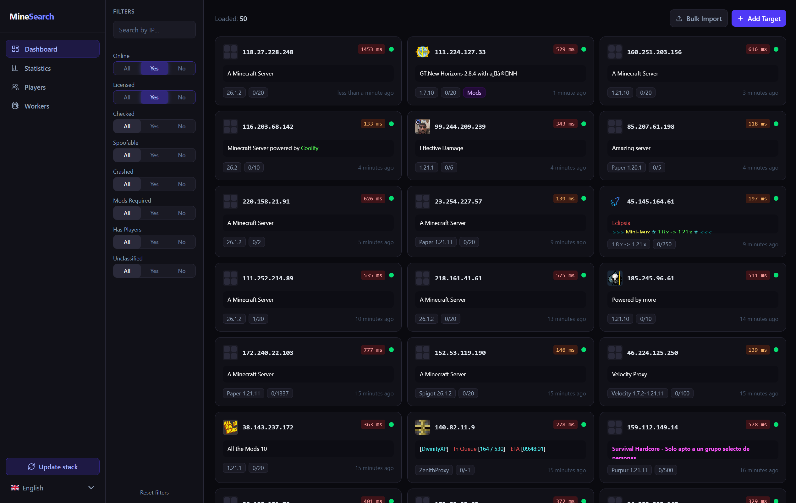
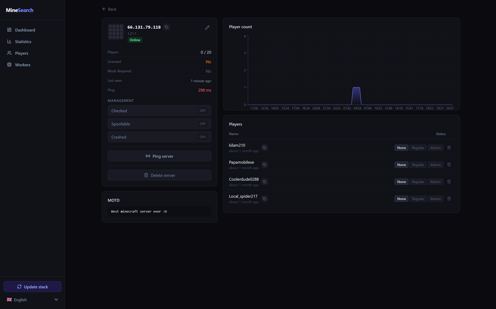
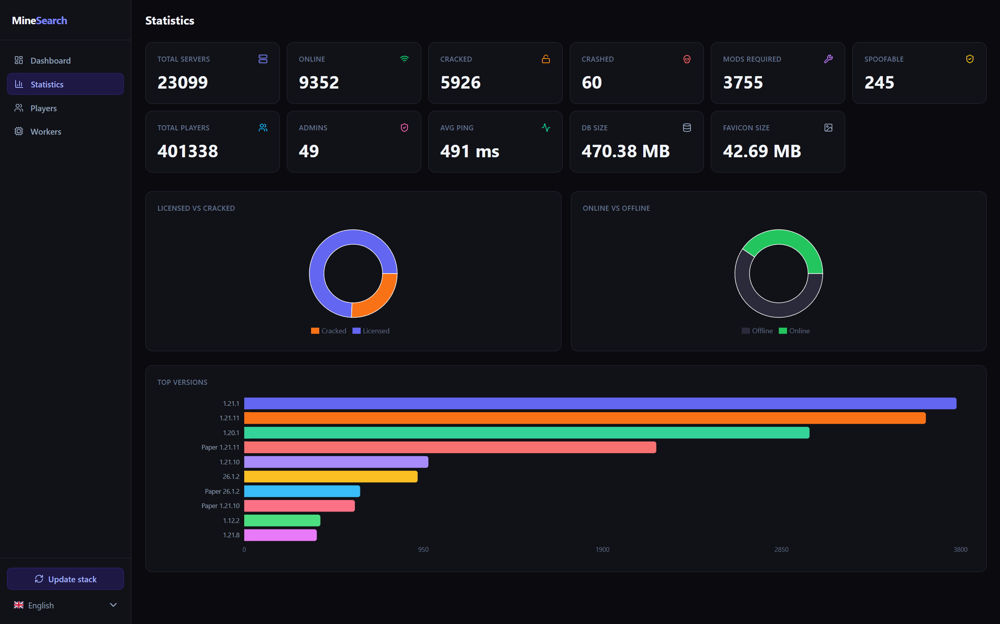

#  MineSearch

[](https://www.gnu.org/licenses/gpl-3.0)

**MineSearch** is a powerful search engine for Minecraft servers. It scans and indexes active servers and nicknames so you can easily find a server and analyze its data.

> [!CAUTION]
> RUNNING THE WORKER MAY RESULT IN YOUR SERVER BEING BLOCKED DUE TO ABUSIVE SCANNING ACTIVITIES. MAKE SURE YOU UNDERSTAND THE RISKS INVOLVED.

# Installation

## Prerequisites

- [Docker](https://docs.docker.com/get-docker/) with Docker Compose

## 1. Clone the repository

```bash
git clone https://github.com/kauri-off/mine_search.git
cd mine_search
```

## 2. Configure environment

Copy `config.example.toml` to `config.toml` and fill in your values:

```bash
cp config.example.toml config.toml
```

Edit `config.toml` — at minimum set `[database].url`, `[backend].password`, and the postgres credentials.

> [!IMPORTANT]
> The `POSTGRES_USER`, `POSTGRES_PASSWORD`, and `POSTGRES_DB` values in `docker-compose.yml` are only applied **on first container creation**. If you change the password after the database volume already exists, you must update it manually inside the container:
> ```sql
> ALTER ROLE <user> WITH PASSWORD 'new_password';
> ```

## 3. Start

```bash
docker compose up -d
```

The backend automatically runs any pending database migrations on startup. The app will be available at `http://localhost:8080`.

## Screenshots





## masscan_wrapper

> **Linux only** — `masscan` requires raw socket access and is only supported on Linux.

`masscan_wrapper` is a CLI utility (written in Rust) that reads a `masscan` grepable output file and bulk-imports discovered IPs into the mine_search API.

### Prerequisites

- Linux
- [Rust / Cargo](https://rustup.rs/) installed
- [`masscan`](https://github.com/robertdavidgraham/masscan) installed (`sudo apt install masscan` or equivalent)

### Build

```bash
cd masscan_wrapper
cargo build --release
# Binary will be at: ./target/release/masscan_wrapper
```

### Usage

#### Step 1 — Scan for Minecraft servers with masscan

Run `masscan` against your target IP range and save the results in grepable (`-oG`) format:

```bash
sudo masscan <range> -p25565 --rate 10000 -oG output.txt
```

Replace `<range>` with the IP range you want to scan, e.g. `10.0.0.0/8`.

#### Step 2 — Import results into the API

```bash
./target/release/masscan_wrapper \
  --endpoint https://example.com \
  --password <your-password> \
  --file output.txt
```

| Flag         | Short | Description                                                  |
| ------------ | ----- | ------------------------------------------------------------ |
| `--endpoint` | `-e`  | Base URL of the mine_search API (e.g. `https://example.com`) |
| `--password` | `-p`  | API login password                                           |
| `--file`     | `-f`  | Path to the masscan `-oG` output file                        |

The tool will:

1. Log in to the API using the provided password.
2. Parse the masscan output file and extract all discovered IPs.
3. Show you how many IPs were found and prompt for confirmation before importing.
4. POST the IP list to the API.

#### Example session

```
[*] Logging in to https://example.com...
[+] Logged in successfully.
[*] Reading masscan output from output.txt...
[+] Found 42 IPs.

Add these 42 IP(s) to https://example.com? [y/N] y
[*] Done.
```

### Notes

- The wrapper expects masscan output in **grepable format** (`-oG`). Other output formats (JSON, XML, binary) are not supported.
- Masscan must be run as **root** (or with `sudo`) because it requires raw socket access.
- Rate (`--rate`) controls packets per second — adjust based on your network and target. High rates may trigger network alarms or cause packet loss.

## License

This project is licensed under the GNU General Public License v3.0. See the [LICENSE](LICENSE) file for details.
